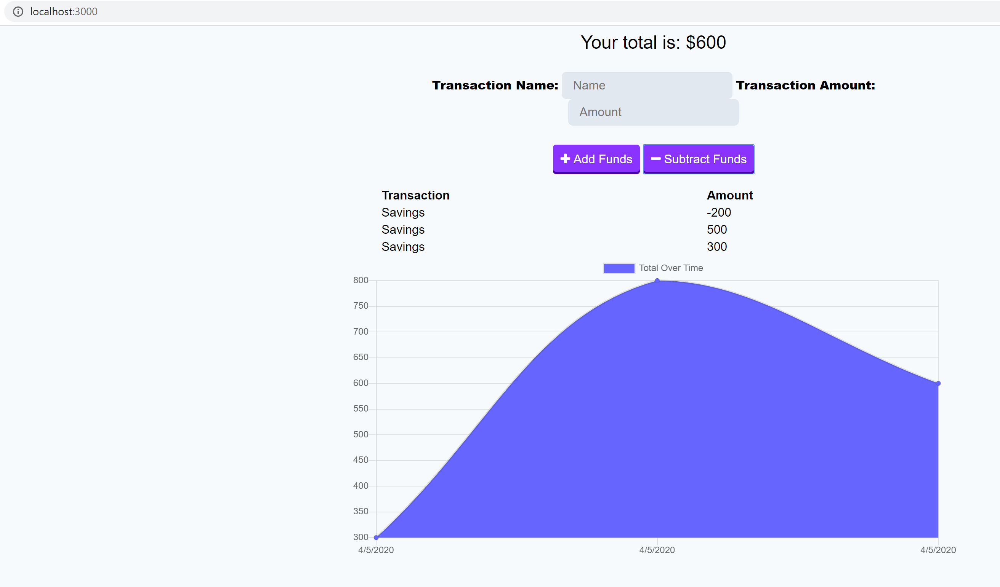

# github.io-budget-tracker

## Description

The puerpose of this project is to provide a budget tracker for users to log personal expense transactions. 

## User Story

```
AS AN avid traveler
I WANT to be able to track my withdrawals and deposits with or without a data/internet connection
SO THAT my account balance is accurate when I am traveling

Business Context
Giving users a fast and easy way to track their money is important, but allowing them to access that information anytime is even more important. Having offline functionality is paramount to our applications success.

```
## Functionality GIF



## How It Works

* User runs 'npm install' for dependencies in the terminal
* Initiates from the command 'npm run start' in the terminal
* User is prompted with inputs for monetary transactions
* User can track transactions with chart

## Link


https://andreathomas19460.github.io/github.io-budget-tracker/
 

## Status 

In progress 

## Author

Andrea Thomas
